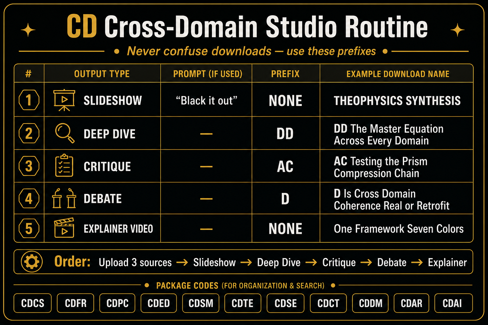

# CD Studio Routine — NotebookLM



Use this exact routine for **every** CD package in NotebookLM Studio.

---

## Step 1 — Upload sources

Open the package folder (example: `CD-CDCS-Canonical-Synthesis/sources/`) and upload all **3** markdown files.

---

## Step 2 — Generate in this order

| # | Output | Studio action | Rename prefix |
|---|---|---|---|
| 1 | **Slide deck** | Slideshow → type **Black it out** | *(none)* |
| 2 | **Deep dive** | Audio overview / deep dive (long) | `DD ` |
| 3 | **Critique** | Critique audio | `AC ` |
| 4 | **Debate** | Debate audio | `D ` |
| 5 | **Explainer** | Video explainer (long form) | *(none)* |

---

## Step 3 — Rename before download

Rename titles **in NotebookLM** so downloads never get confused:

```
DD  [deep dive title]
AC  [critique title]
D   [debate title]
[slideshow title]          ← no prefix
[explainer video title]    ← no prefix
```

### Prefix rules

- **Deep Dive** → starts with `DD ` (two Ds, then space)
- **Critique** → starts with `AC ` (A-C, then space)
- **Debate** → starts with `D ` (one D, then space)
- **Slideshow** → no prefix
- **Explainer video** → no prefix

---

## Step 4 — Download and file

Save downloads into that package's `notebooklm/` folder:

```
CD-CDCS-Canonical-Synthesis/
  sources/           ← 3 markdown uploads
  notebooklm/
    manifest.json    ← planned titles
    vocabulary.md    ← 8th-grade word list (after pass)
    [downloaded outputs]
```

---

## Step 5 — Vocabulary pass

Ask NotebookLM:

> List every word or phrase above an 8th-grade reading level. For each, give a one-sentence plain-English definition a 14-year-old would understand.

Save to `notebooklm/vocabulary.md`.

---

## Production order (all 11 packages)

`CDCS → CDFR → CDPC → CDED → CDSM → CDTE → CDSE → CDCT → CDDM → CDAR → CDAI`

Start with **CDCS Canonical Synthesis**.
